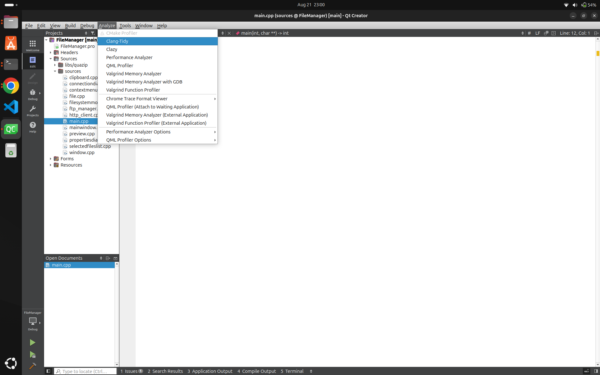
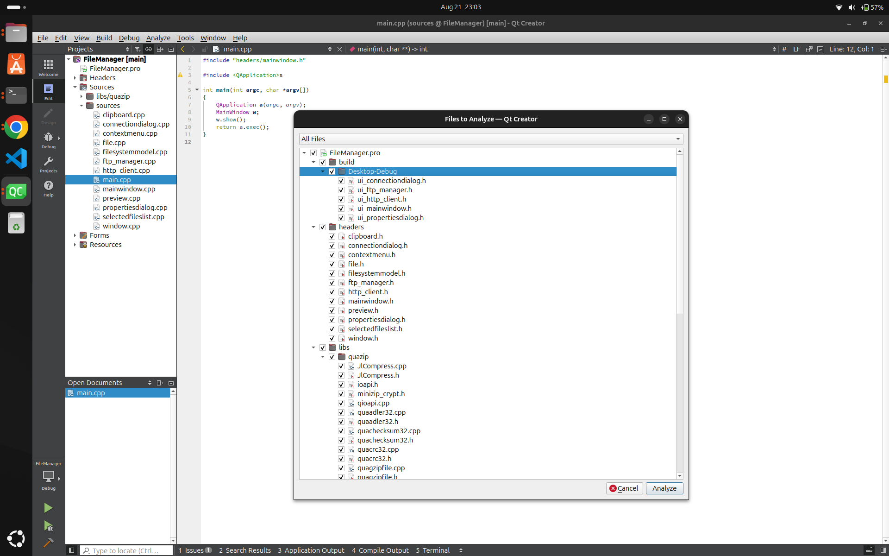
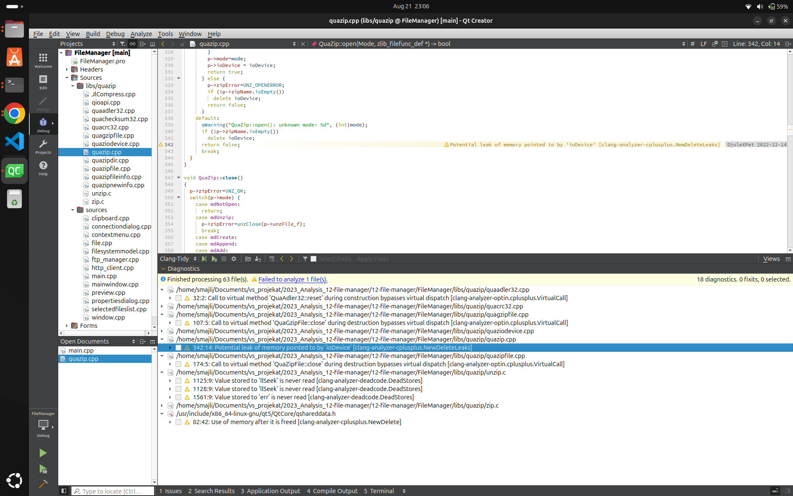
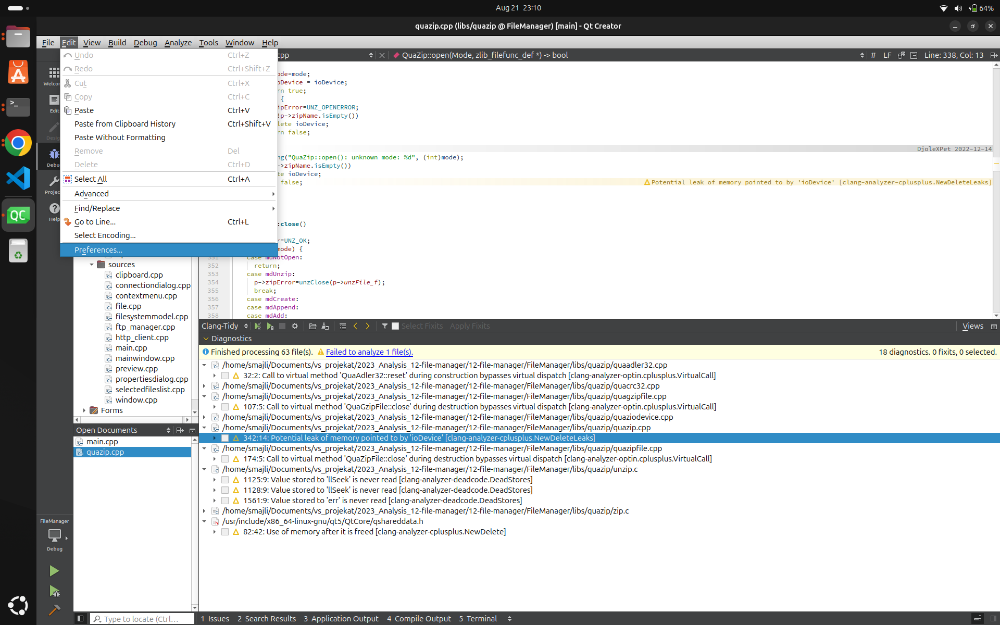
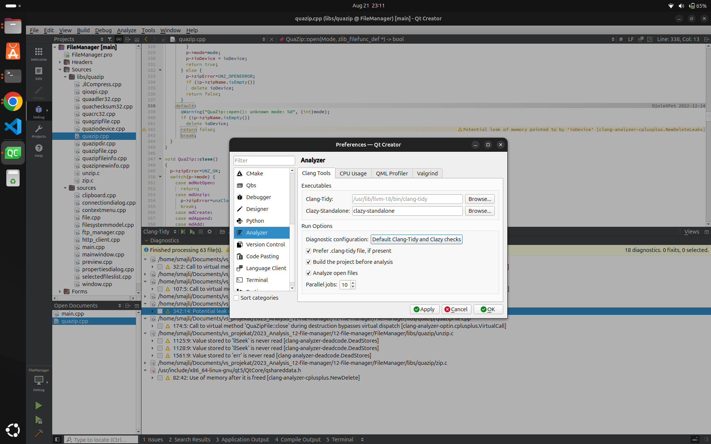
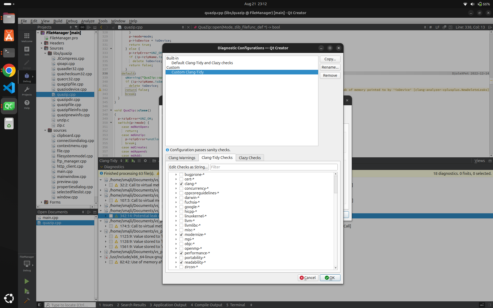
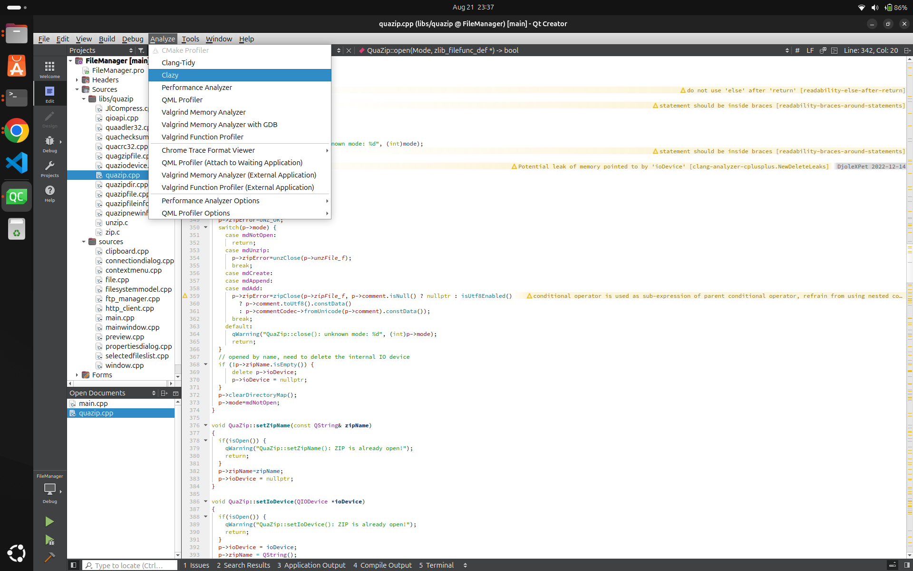
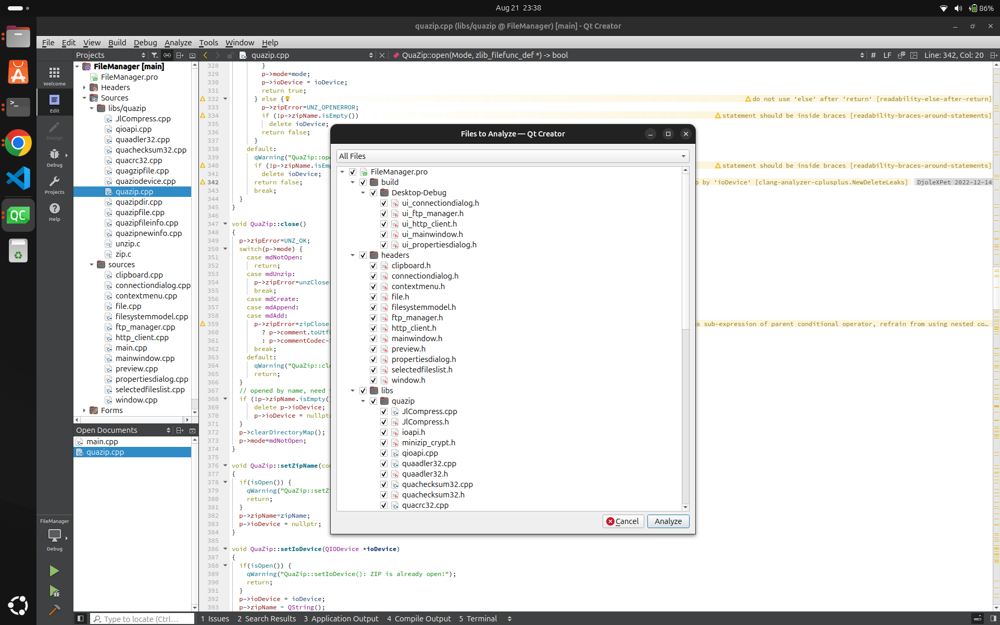
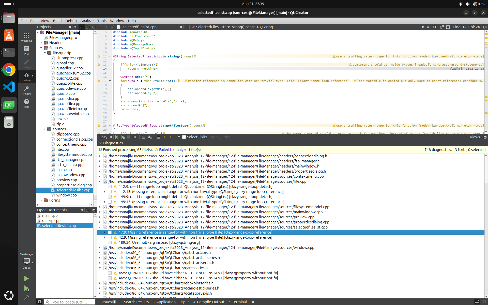

# Izveštaj analize projekta

## Clang
Clang je kompilator za C i C++ jezike koji je deo LLVM projektne porodice. Poznat je po svojoj brzini, tačnosti i modularnoj arhitekturi.
## Clang-tidy
Clang-Tidy je moćan alat za statičku analizu koda koji je deo Clang alatnog lanca. Njegova osnovna funkcija je da identifikuje i predloži poboljšanja u C++ kodu, kao što su optimizacije, ispravke grešaka i stilističke promene. 
Takođe može da pomogne u održavanju koda u skladu sa najnovijim standardima i najboljim praksama.

Ovaj alat je integrisan u QtCreator-u i može se pokrenuti sa podrazumevanim (default) ili sa prilagođenom (custom) konfiguracijom.

-Ovaj alat pokreće sa default konfiguracijom tako što iz gornjeg menu bar-a izaberemo Analyze i odaberemo alat Clang-tidy.
  
- Nakon toga se izaberu fajlovi nad kojima će se vršiti analiza.
  
- Nakon toga pritiskom na dugme Analyze pokreće se analiza.
  
- Možemo da vidimo koja upozorenja je pokazala analiza.

- Custom konfiguracija se može napraviti tako što se iz menu bar-a izabere Edit i odabere Preferences.
  
- Kada se otvori novi prozor izabere se Analyzer i stisne Default Clang-tidy and Clazy checks.
  
- Napravi se nova konfiguracija i promeni se ime, u mom slučaju Custom Clang-tidy. Nakon toga štikliraju se opcije koje će se koristiti prilikom analize. u mom slučaju clang, modernize, readibility i performance.
  
- Nakon analize može se videti da ima mnogo više upozorenja. Neka od upozorenja se odnose na magične brojeve, neka na makroe, takođe da su neka imena previše kratka.

  ## Clazy

  Clazy je dodatak za kompajler koji omogućava Clang-u da razume Qt semantiku. Pruža više od 50 upozorenja povezanih s Qt-om, koja obuhvataju sve od nepotrebnih alokacija memorije do pogrešne upotrebe API-ja, uključujući automatske ispravke za refaktoring.
  Ovaj alat je takođe integrisan u QtCreator-u i može se pokrenuti sa podrazumevanim (default) ili sa prilagođenom (custom) konfiguracijom.

  -Ovaj alat pokreće sa default konfiguracijom tako što iz gornjeg menu bar-a izaberemo Analyze i odaberemo alat Clazy.
    
  - Nakon toga se izaberu fajlovi nad kojima će se vršiti analiza.
    
  - Nakon toga pritiskom na dugme Analyze pokreće se analiza.
    
  - Default konfiguracija podrazumeva dva nivoa provere nivo 0 i nivo 1.
 
  - Custom konfiguracija se može napraviti tako što se iz menu bar-a izabere Edit i odabere Preferences. Kada se otvori novi prozor izabere se Analyzer i stisne Default Clang-tidy and Clazy checks.  Napravi se nova konfiguracija i promeni se ime, u mom slučaju Custom Clang-tidy. Izabere se kartica Clazy checks i izaberu se nivoi sa kojima će se raditi analiza. Ja sam u svom projektu koristio default konfiguraciju.
    

