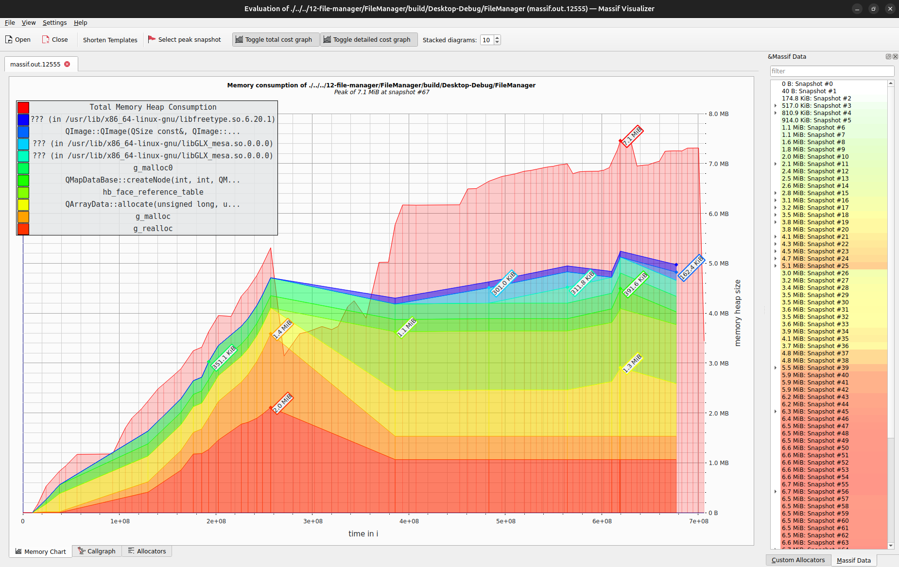

# Izveštaj analize projekta

### Clang
Clang je kompilator za C i C++ jezike koji je deo LLVM projektne porodice. Poznat je po svojoj brzini, tačnosti i modularnoj arhitekturi.
## Clang-tidy
Clang-Tidy je moćan alat za statičku analizu koda koji je deo Clang alatnog lanca. Njegova osnovna funkcija je da identifikuje i predloži poboljšanja u C++ kodu, kao što su optimizacije, ispravke grešaka i stilističke promene. 
Takođe može da pomogne u održavanju koda u skladu sa najnovijim standardima i najboljim praksama.

Ovaj alat je integrisan u QtCreator-u i može se pokrenuti sa podrazumevanim (default) ili sa prilagođenom (custom) konfiguracijom.

-Ovaj alat pokreće sa default konfiguracijom tako što iz gornjeg menu bar-a izaberemo Analyze i odaberemo alat Clang-tidy.
  
- Nakon toga se izaberu fajlovi nad kojima će se vršiti analiza.
  
- Nakon toga pritiskom na dugme Analyze pokreće se analiza.
  
- Možemo da vidimo koja upozorenja je pokazala analiza.

- Custom konfiguracija se može napraviti tako što se iz menu bar-a izabere Edit i odabere Preferences.
  
- Kada se otvori novi prozor izabere se Analyzer i stisne Default Clang-tidy and Clazy checks.
  
- Napravi se nova konfiguracija i promeni se ime, u mom slučaju Custom Clang-tidy. Nakon toga štikliraju se opcije koje će se koristiti prilikom analize. u mom slučaju clang, modernize, readibility i performance.
  
- Nakon analize može se videti da ima mnogo više upozorenja. Neka od upozorenja se odnose na magične brojeve, neka na makroe, takođe da su neka imena previše kratka.

  ### Clazy

  Clazy je dodatak za kompajler koji omogućava Clang-u da razume Qt semantiku. Pruža više od 50 upozorenja povezanih s Qt-om, koja obuhvataju sve od nepotrebnih alokacija memorije do pogrešne upotrebe API-ja, uključujući automatske ispravke za refaktoring.
  Ovaj alat je takođe integrisan u QtCreator-u i može se pokrenuti sa podrazumevanim (default) ili sa prilagođenom (custom) konfiguracijom.

  -Ovaj alat pokreće sa default konfiguracijom tako što iz gornjeg menu bar-a izaberemo Analyze i odaberemo alat Clazy.
    
  - Nakon toga se izaberu fajlovi nad kojima će se vršiti analiza.
    
  - Nakon toga pritiskom na dugme Analyze pokreće se analiza.
    
  - Default konfiguracija podrazumeva dva nivoa provere nivo 0 i nivo 1.
 
  - Custom konfiguracija se može napraviti tako što se iz menu bar-a izabere Edit i odabere Preferences. Kada se otvori novi prozor izabere se Analyzer i stisne Default Clang-tidy and Clazy checks.  Napravi se nova konfiguracija i promeni se ime, u mom slučaju Custom Clang-tidy. Izabere se kartica Clazy checks i izaberu se nivoi sa kojima će se raditi analiza. Ja sam u svom projektu koristio default konfiguraciju.
    

  ## Valgrind
  Valgrind je alat za analizu i otkrivanje grešaka u upravljanju memorijom u programima. Pomaže u identifikaciji problema kao što su curenje memorije, neinicijalizovana memorija, i pogrešna upotreba pokazivača.
  Valgrind alati:
  - Memcheck - detektor memorijskih grešaka
  - Massif - praćenje dinamičke memorije
  - Cachegrind - profajler keš memorije
  - Callgrind - profajler funkcija
  - DRD - detektor grešaka niti
  - Helgrind - detektor grešaka niti
 
  Valgrind se instalira pomoću sledeće komande:
  ```
  sudo apt-get install valgrind
  ```

  ### Memcheck
  Memcheck detektuje memorijske greške korisničkog programa. Kako vrši analizu mašinskog koda, ima mogućnost analize programa pisanog u bilo kom jeziku. Može da detektuje upisivanje podataka van opsega hipa ili steka, pristup oslobođenoj memoriji, neispravno oslobađanje i curenje memorije.

  Memcheck je podrazumevani alat Valgrnda. Poziva se pomoću komande:
  ```
  valgrind --track-origins=yes --show-leak-kinds=all --leak-check=full --log-file="memcheck.txt" ./FileManager
  ```

  Opcije koje su uključene prilikom analize:
  - --track-origins=yes -> pomaže u lociranju uzroka grešaka vezanih uz neinicijalizovanu memoriju
  - --show-leak-kinds=all -> prikazuje sve vrste curenja memorije
  - --leak-check=full -> aktivira potpunu proveru curenja memorije
  - --log-file="memcheck.txt" -> fajl gde se upisuju rezultati analize
 
  Analiza projekta se može pokrenuti pomocu ove [skripte](valgrind/memcheck/memcheck.sh):
  ```
  ./memcheck.sh
  ```
  Izvešraj analize je sačuvan u fajlu [memcheck.txt](valgrind/memcheck/memcheck.txt)
  ```
  ==12269== HEAP SUMMARY:
  ==12269==     in use at exit: 2,526,754 bytes in 24,177 blocks
  ==12269==   total heap usage: 439,492 allocs, 415,315 frees, 208,679,436 bytes allocated

  ==12269== LEAK SUMMARY:
  ==12269==    definitely lost: 48 bytes in 2 blocks
  ==12269==    indirectly lost: 96 bytes in 2 blocks
  ==12269==      possibly lost: 2,160 bytes in 5 blocks
  ==12269==    still reachable: 2,433,378 bytes in 23,341 blocks
  ==12269==                       of which reachable via heuristic:
  ==12269==                         newarray           : 4,264 bytes in 1 blocks
  ==12269==         suppressed: 0 bytes in 0 blocks
  ```
  Ovo je samo sažetak koji se nalazi u memcheck.txt. Možemo da vidimo da ima curenje memorije, ali nema previše. Primetio sam da postoji alocirana memorija koje kasnije nije dealocirana.

  ### Massif

  Massif je alat za analizu heap memorije. Detektuje curenje memorije kada ona nije izgubljena, ali se više ne koristi. Daje informacije o tome koliko heap memorije se koristi i koji deo programa je alocirao tu memoriju. Rezultate piše u poseban fajl, ima funkciju za prikaz u čitljivom formatu i grafik koji pokazuje trošenje memorije tokom izvršavanja programa.

  Poziva se pomoću komande:
  ```
  valgrind --tool=massif ./FileManager
  ```
  Rezultat je upisan u fajl [massif.out.*](valgrinf/massif/massif.12555), a pomoću komande ms_print se upisuju rezultati u [massif.txt](valgrind/massif/massif.txt) koji su čitljivi.
  ```
  ms_print massif.out.12555 > massif.txt
  ```
  Dobijeni podaci se mogu predstaviti vizuelno pomoću Massif Visualizer-a, dobija se graf.
  
  

  Sa grafa se može videti da je najveća potrošnja memorije u 67. preseku i da je to 7.1 MB. Iz ovoga se može zaključiti da postoji curenje memrije, ali ono nije veliko.

  

